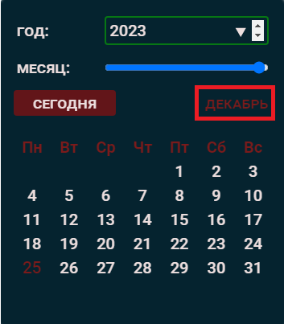

## Приложение _'gri_calendar'_

#### Приложение написано с использованием Vanilla JS, HTML, СSS, SCSS (SASS).

#### В дальнейшем, планируется перевести Весь проект на Typescript.

---

#### Исходная структура папок source-code-файлов представлена ниже:

- **constants**
  - _index.js_
- **fonts**
  - font 1
  - font 2
  - ...
  - font N
- **images**
  - image1
  - image N
- **scss**
  - index.scss
  - **temp**
    - temp1.scss
    - temp2.scss
    - tempN.scss
- **services**
  - Calendar.js -- Главный класс для отрисовки DOM-элементов и управления пользовательскими действиями Календаря)
  - services.js -- вспомогательные утилиты)
- **store**
  - Store.js -- класс для установки и изменения даты и реактивной отрисовки изменений на UI (стороне пользователя)
- **index.css** -- файл базовых стилей
- **index.min.css** -- файл минифицированных базовых стилей, сгененированный из файлов папки **scss**
- **index.html** -- HTML (показан для примера)
- **index.js** -- главный индексный файл (показан для примера)
- **readme.md** -- файл описания приложения

---

#### Входной точкой является файл _index.js_, который подключается к _index.html_. _index.js_ в исходниках имеет атрибут **type='module'** и **defer** (Важно! если Вы не используете сборщики!).

Разметка в Вашем _index.html_ должна выглядить примерно так:

```html
<html lang="en">
  <head>
    <!-- Можно использовать google.fonts API: -->
    <!-- <link rel="preconnect" href="https://fonts.gstatic.com" crossorigin>
    <link
      href="https://fonts.googleapis.com/css2?family=Bebas+Neue&family=Montserrat:wght@300;500;700&family=Nunito+Sans:opsz@6..12&family=Roboto:wght@300;500;700&family=Ubuntu&display=swap"
      rel="stylesheet"
    /> -->
    <!-- Укажите путь до локальных стилей: index.min.css / index.css: -->
    <link rel="stylesheet" href="./index.css" />
    <!-- Укажите путь к Вашему главному JS-файлу: -->
    <script src="./index.js" type="module" defer></script>
  </head>
  <body>
    <section class="calendar">
      <!-- Сюда будет динамически добавлена вся разметка Календаря при помощи скриптов -->
    </section>
  </body>
</html>
```

---

#### Для подключения 'базовой конфигурации CSS-стилей' - используйте способы выше!

---

#### Локальные шрифты, интегрированные в 'базовую конфигурации стилей', представлены 5 семействами:

- "Roboto",
- "Montserrat",
- "Bebas Neue",
- "Nunito Sans",
- "Ubuntu".
  <br>
  Добавляйте шрифты в папку _'fonts'_ и вносите изменения в базовые _'index.css'_ / _'index.min.css'_:

```css
@font-face {
  font-family: "Roboto";
  src: url("./fonts/Roboto-Light.ttf");
  font-weight: 300;
  font-display: swap;
  font-style: normal;
}
```

---

#### Для инициализации Класса _'Calendar'_ в Вашем js-файле запустите следующий код:

```javascript
// константы
import { CALENDAR, WEEK_DAY, INPUT_LIST } from "./constants/index.js";
// класс состояния даты
import { Store } from "./store/Store.js";
// Класс календаря
import Calendar from "./services/Calendar.js";

const calendar = new Calendar(
  // CALENDAR - это DOM-элемент с классом 'calendar' (см. index.html выше!)
  {
    calendar: CALENDAR,
    store: Store, // управление состоянием даты с автоматической отрисовкой актуальной даты
    weekday: WEEK_DAY,
    inputList: INPUT_LIST,
    delay: 10, // шаг задержки в ms при отображения месячных дат
  },
  {} // второй аргумент - объект **options** для передачи пользовательских инлайн-стилей
);
```

---

#### Объект **options** для кастомных inline-стилей:

Для кастомизации стилей при вызове конструктора new Calendar(obj, options), второй аргумент **options** должен иметь вид:

```javascript

// Валидными значениями каждого из 4-х Селекторов выступают объекты СSS-стилей, описанные в JS-нотации:

{
  [selector1]: {
      textDecoration: "line-through",
      color: "orangered",
      transform: "rotateZ(5deg)",
    },
  [selector2]: { backgroundColor: "whitesmoke" },
  [selector3]: null,
  [selector4]: { backgroundColor: "green" },
  [selector5]: {backdropFilter: 'grayscale(.8)'},
}

```

Пока, для стилизации через **options** / **API** доступно 5 Селекторов, 'представляющих' 5 DOM-элементов:

- **'$calendar'** - главный контейнер календаря:<br>
  
- **'$year'** - инпут для выбора календарного года:<br>
  
- **'$monthName'** - элемент отображения текущего месяца:<br>
  
- **'$calendarField'** - поле отображения месячных дат:<br>
  
- **'$overlay'** - промежуточный слой, находящийся по оси Z между слоем UI-элементов (**'$year'**, **'$monthName'**, **'$calendarField'**) и главным контейнером (**'$calendar'**). Позволяет использовать св-во 'backdrop-filter' при задании изображения в качестве фона Селектора **'$calendar'**.

Пример Валидного объекта **options**:

```javascript

  {
    $calendarField: {
      transform: "rotateZ(5deg)",
      fontFamily: "Nunito Sans",
    },
    $year: { backgroundColor: "teal" },
    $month: false,
    // относительные пути изображений в вашем проекте могут отличаться!
    $calendar: { fontFamily: "Montserrat", background: './images/test1.jpg' },
  }

```

Результатом передачи объекта **options** выше будет:


##### Допустимо:

- передавать пустой объект **options**;
- стилизовать конкретные Селекторы;
- использовать в качестве значений Селекторов 'лживые' значения: **null** / **undefined** / **''** / **false**

```javascript

  {
    $calendarField: '',
    $year: null,
    $calendar: { fontFamily: "Montserrat", },
  }

```

В примере выше задействованы конкретные Селекторы. У некоторых, вместо объектов СSS-стилей, значениями выступают 'лживые' значения: **ошибки не будет, стили не создадутся!**

#### ВАЖНО! объект **options** манипулирует с inline-стилями (CSS-специфичность: **1, 0, 0, 0**). Если необходимо, в дальнейшем, переопределить или добавить к ним новые стили - воспользуйтесь методами API (рассмотрим далее...), либо вовсе не передавайте св-ва.

#### Примеры аналогичных стилей в CSS и JS:

```css
<style>
    selector {
        color:red;
        background-color: #fff;
        padding-bottom: 25px;
        width: 100%;
        font-weight: 700;
    }

</style>
```

```javascript
// В JS СSS-свойства обычно представляются в виде объектов, ключи которых описаны в _'camelCase'_ нотации, а значения типами string или number(для св-в: 'zIndex','fontWeight')

const obj = {
  color: "red",
  backgroundColor: "#fff",
  paddingBottom: "25px",
  width: "100%",
  fontWeight: 700,
};
```

#### Наследование:

#### Inline-стили, переданные Селектору '$calendar' наследуется всеми компонентами, в т.ч. элементами input, button. Это работает при использовании базовых стилей (index.min.css / index.css):

```javascript

  // объект options

  {
    $calendar: { fontFamily: "Ubuntu", color: 'teal', textTransform: 'uppercase'},
  }

```

Результат:


---

#### Работа с Селектором '$overlay' актуальна при передачи Селектору '$calendar' в качестве фона - статического изображения:

###### UI-элементы плохо отображаются при фоновой картинке:

```javascript

  // объект options

  {
    $calendar: {backgroundImage: 'url(./images/test1.jpg)'},
    $overlay: null
  }

```


###### Все нормально, при стилизации Селектора '$overlay':

```javascript

  // объект options

  {
    $calendar: {
      backgroundImage: "url(./images/test1.jpg)", color: "whitesmoke"},
    $overlay: { backdropFilter: "grayscale(.55) blur(2.1px)" },
  }

```

## 

#### Валидация:

#### касается элемента с Селектором '$year' - инпут для ввода календарного года. Валидными для Селектора '$year' являются значения с 1900 по 2100 гг включительно. Визуализация валидных и невалидных значений реализована.

#### Есть подсказки при вводе календарного года.

#### ПРИМЕРЫ:

- **Невалидный год**:<br>
  
- **Снова невалидный...**:<br>
  
- **ВСЕ ОК!**:<br>
  

#### Кнопка _"Сегодня"_ сбрасывает ранее выбранное состояние и отображает текущую дату!

---

# API:

#### После вызова Инстанса класса **_Calendar_** (cм. выше) нам доступны методы:

#### Темизация:
#### Метод переключает тему: со светлой на темную и наоборот (работает при использовании базовых стилей index.min.css / index.css):

```javascript
// объект options получает cтили:

// cтартуем:
calendar.toggleTheme();
```

#### Переключение на светлую тему (lightMode):


---

#### Изменение видимости:

#### Можно скрыть / показать элемент Календаря (работает при использовании базовых стилей index.min.css / index.css)

```javascript
// скрыть / показать:

calendar.toggleHidden();
```

---

#### Логирование текущей даты:

```javascript

// логируемся:

  calendar.logCurrDate()

// Результат объекта Даты в консоли:

{year: 2023, month: 11, date: 21}

```

---

#### Получение строки с текущей датой:

```javascript
calendar.getCurrDateString() 

// Результат в консоли:
`2023 декабрь 25`;
```
---

#### Удаление inline-стилей всех Селекторов:

```javascript
// удаляем:
// обратно к предустановленным стилям файлов index.min.css/ index.css

calendar.removeInlineStyles();
```

---

#### Удаление inline-стилей определенного Селектора:

```javascript
// Передаем аргументом строку с Селектором, inline-стили которого хотим удалить:

calendar.removeSelectorStyles("$calendarField");
```

---

#### Добавление inline-стилей Селектору:

#### Метод **addSelectorStyles** принимает 2 аргумента:

- ###### selector - один из 5-ти ранее описанных Селекторов;
- ###### styles - строка стилей в СSS-нотации либо '': <br>
'text-transform: uppercase; background: white;'

```javascript
// 1 аргумент - Селектор, inline-стили которого необходимо обновить или расширить:
// Важно! метод не удаляет сущ. inline-стили, а добавляет новые либо перезаписывает одноименные!

calendar.addSelectorStyles(
  "$calendar",
  "text-transform: uppercase; background: white"
);
```
