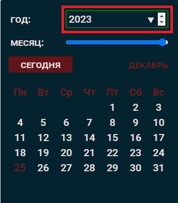
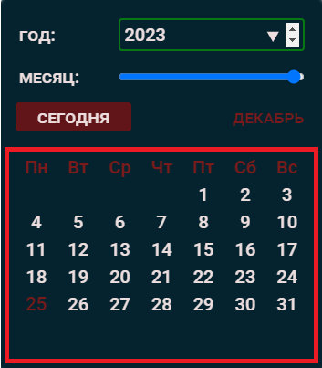
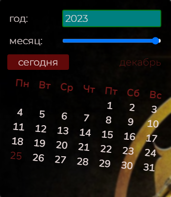
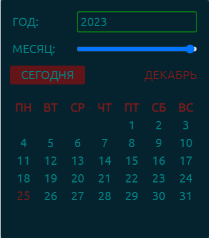
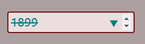

## Приложение _'GRI_calendar'_

#### Приложение использует Vanilla JS, TYPESCRIPT, HTML, СSS/SCSS.

---

#### Структура папок:

- **calendar** - папка скомпиллированных и минифицированных файлов.
  - services:
     - Calendar.js
     - services.js 
  - store: 
     - Store.js
  - constants:
     - index.js
  - index.min.css  
  - fonts
- **src** -- исходники
- **readme.md** -- файл описания
- **tsconfig.json** -- конфиг. файл настроек ts-компилятора
- **index.html**

#### src:

- **constants**
  - _index.ts_
- **fonts**
  - font 1
  - font 2
  - ...
  - font N
- **images**
  - image1
  - image N
- **scss**
  - index.scss
  - **temp**
    - \_desktop.scss
    - \_fonts.scss
    - \_general.scss
    - \_iconFonts.scss
    - \_media.scss
    - \_vars.scss
- **services**
  - Calendar.ts -- Главный класс для создания UI-элементов и обработчиков событий Календаря)
  - services.ts -- утилиты
- **store**
  - Store.ts -- класс для управления состоянием даты и реактивной отрисовки изменений на UI
- **types**
  - types.ts -- файл с описанием основных типов приложения
- **index.css** -- файл базовых стилей
- **index.min.css** -- файл минифицированных базовых стилей (собран из **scss**)
- **index.ts** -- вх. точка (для примера)

---

#### Если не используются сборщики, то Ваш главный файл _index.js_ должен иметь атрибут **type='module'**.

#### Образец разметки:

```html
<html lang="en">
  <head>
    <!-- Google.fonts API: -->
    <!-- <link rel="preconnect" href="https://fonts.gstatic.com" crossorigin>
    <link
      href="https://fonts.googleapis.com/css2?family=Bebas+Neue&family=Montserrat:wght@300;500;700&family=Nunito+Sans:opsz@6..12&family=Roboto:wght@300;500;700&family=Ubuntu&display=swap"
      rel="stylesheet"
    /> -->    
  </head>
  <body>
    <!-- Необходимая разметка: -->
    <section class="calendar">
      <!-- Сюда будет сгененирован Календарь! -->
    </section>
  </body>
</html>
```
---

#### Для подключения 'базовой конфигурации CSS-стилей':

```html
<html lang="en">
  <head>
    <!-- Укажите путь до файлов: index.min.css / index.css: -->
    <link rel="stylesheet" href="./calendar/index.min.css.css" />
  </head>
  <body>
    <!-- Главный файл index.js -->
    <script src="./index.js" type="module"></script>
  </body>
</html>
```

---

#### Для инициализации Класса _'Calendar'_ в главном JS-файле запустите следующий код:

```javascript
// Образец пути до файла Calendar.js
import Calendar from "./calendar/services/Calendar.js";

const calendar = new Calendar(
  {
    delay: 18, // шаг задержки в ms (number) при отображения месячных дат, необязательный параметр
    time: true, // включает панель текущего времени (boolean), необязательный параметр
  },
  {} // второй аргумент - объект **options** для стилизации, необязательный параметр
);

// В варианте ниже будут использованы дефолтные значения для параметров: delay, time. Стилизация будет реализована базовыми стилями ():
const calendar = new Calendar({});
```

---

### Несколько простых шагов для подключения календаря в Ваш проект:

#### 1. Добавьте в Ваш проект папку 'calendar', содержащую: скомпилированные js-файлы, минифицированные стили, 5 локальных семейств шрифтов.

#### 2. Подключите базовый CSS календаря в index.html:

```html
<html lang="en">
  <head>
    <!-- Образец пути до файла стилей -->
    <link rel="stylesheet" href="./calendar/index.min.css" />
    <!-- Главный файл index.js -->
    <script src="./index.js" type="module" defer></script>
  </head>
  <body>
    <!-- Your Code -->
  </body>
</html>
```

#### 3. В index.html создайте разметку с контейнером для Календаря:

```html
<html lang="en">
  <head>
    <!-- Your code  -->
  </head>
  <body>
    <!-- Необходимая разметка -->
    <section class="calendar">
      <!-- Сюда будет сгененирован Календарь! -->
    </section>
  </body>
</html>
```

#### 4. В главный файл index.js импортируйте класс _Calendar_, указав путь до файла _Calendar.js_:

```javascript
// Пример:
import Calendar from "./calendar/services/Calendar.js";

const calendar = new Calendar(
  {
    delay: 18, // необязательный параметр
    time: true, // необязательный параметр
  },
  {} // необязательный параметр
);
```

#### 5. Поместите папку с локальными шрифтами _fonts_ в проект, указав в index.min.css / index.css путь до конкретных семейств (примеры ниже)

---

#### Объект **options** для кастомных inline-стилей:

Для кастомизации стилей в конструктор **new Calendar(settings, options)**, вторым аргументом передают объект стилей:

```javascript

// Значениями каждого из 8 Селекторов выступают объекты СSS-стилей, описанные в JS-нотации:

{
  [selector1]: {
      textDecoration: "line-through",
      color: "orangered",
      transform: "rotateZ(5deg)",
    },
  [selector2]: { backgroundColor: "whitesmoke" },
  [selector3]: null,
  [selector4]: { backgroundColor: "green" },
  [selector5]: {backdropFilter: 'grayscale(.8)'},
  [selector6]: {},
  [selector7]: {},
  [selector8]: {},
}

```

Для стилизации через 2 аргумент **options** либо через методы **API** - доступно 8 Селекторов, 'представляющих' 8 DOM-элементов:

- **'$calendar'** - главный контейнер календаря:<br>
  
- **'$year'** - инпут для выбора календарного года:<br>
  
- **'$monthName'** - элемент отображения текущего месяца:<br>
  
- **'$calendarField'** - поле отображения месячных дат:<br>
  
- **'$panelTime'** - поле отображения текущего времени:<br>
  
- **'$panelBtn'** - кнопка отображения актуальной даты: <br>
  
- **'$controls'** - панель отдельных API-функций: <br>
  
- **'$overlay'** - промежуточный слой, находящийся по оси Z между слоем основных UI-элементов и главным контейнером (**'$calendar'**). Позволяет использовать св-во 'backdrop-filter' при задании изображения в качестве фона **'$calendar'**.

Пример Валидного объекта **options**:

```javascript

  {
    $calendarField: {
      transform: "rotateZ(5deg)",
      fontFamily: "Nunito Sans",
    },
    $year: { backgroundColor: "teal" },
    $month: false,
    // относительные пути изображений в вашем проекте могут отличаться!
    $calendar: { fontFamily: "Montserrat", background: 'url(./images/test1.jpg)' },
  }

```

Результатом передачи объекта **options** выше будет:



##### Допустимо:

- Не передавать объект **options** в Конструктор или передавать пустой объект (применятся базовые стили)
- стилизовать конкретные Селекторы;
- использовать в качестве значений свойств Селекторов как объекты СSS-стилей, так и 'лживые' значения: **null** / **undefined** / **''** / **false**

```javascript

 // У некоторых Селекторов, вместо объектов СSS-стилей, значениями выступают 'лживые' значения: ошибки не будет, стили не создадутся!

  {
    $calendarField: '',
    $year: null,
    $calendar: { fontFamily: "Montserrat", },
  }

```

#### ВАЖНО! объект **options** добавляет inline-стили (Специфичность: **1, 0, 0, 0**). Для переопределения - воспользуйтесь методами API (далее).

#### Примеры аналогичных стилей в CSS и JS:

```css
<style>
    selector {
        color:red;
        background-color: #fff;
        padding-bottom: 25px;
        width: 100%;
        font-weight: 700;
    }

</style>
```

```javascript
// В JS стили описываются в виде объектов: ключи в camelCase нотации, а значения в виде строк либо чисел('zIndex','fontWeight' и т.п.)

const obj = {
  color: "red",
  backgroundColor: "#fff",
  paddingBottom: "25px",
  width: "100%",
  fontWeight: 700,
};
```

---

#### Стили Селектора '$calendar' наследуется всеми компонентами. Это работает при использовании базовых стилей (index.min.css / index.css):

```javascript

  // объект options

  {
    $calendar: { fontFamily: "Ubuntu", color: 'teal', textTransform: 'uppercase'},
  }

```

Результат:



---

#### Работа с Селектором '$overlay' актуальна при передачи Селектору '$calendar' в качестве фона - статического изображения:

###### UI-элементы плохо отображаются при фоновой картинке:

```javascript

  // объект options
  {
    $calendar: {backgroundImage: 'url(./images/test1.jpg)'},
    $overlay: null
  }

```


###### При стилизации Селектора '$overlay':

```javascript

  // объект options
  {
    $calendar: {
      backgroundImage: "url(./images/test1.jpg)", color: "whitesmoke"},
    $overlay: { backdropFilter: "grayscale(.55) blur(2.1px)" },
  }

```

## 

---

#### Локальные шрифты представлены 5 семействами и иконочным шрифтом от [Bootstrap Icons](https://icons.getbootstrap.com/ "Нigh quality, open source icon library")!:

- "Roboto",
- "Montserrat",
- "Bebas Neue",
- "Nunito Sans",
- "Ubuntu".
- "bootstrap-icons" - иконочный шрифт от [Bootstrap](https://icons.getbootstrap.com/ "Bootstrap Icons")! <br>

###### Добавляйте шрифты в папку _'fonts'_ и вносите изменения в базовые стили:

```css
/* Код в index.css / index.min.css*/
@font-face {
  font-family: "Roboto";
  /* относительный путь до папки fonts в Вашем проекте */
  src: url("./fonts/Roboto-Light.ttf");
  font-weight: 300;
  font-display: swap;
  font-style: normal;
}
```

---

#### Валидными для Селектора '$year' являются значения с 1900 по 2100 гг. включительно. Реализованы: визуализация валидных / невалидных значений; подсказки при вводе календарного года.

#### ПРИМЕРЫ:

- **Невалидный год**:<br>
  
- **Снова невалидный...**:<br>
  
- **ВСЕ ОК!**:<br>
  

---

#### Селектор _'$panelBtn'_ сбрасывает ранее выбранное состояние внутреннего объекта **_currDate_** и отображает текущую дату!

---

# API:

#### После вызова Инстанса класса **_Calendar_** (cм. выше) нам доступны методы:

#### Темизация: переключение темы со светлой на темную и наоборот (работает при использовании базовых стилей index.min.css / index.css):

```javascript
// cтартуем:
calendar.toggleTheme();
```

#### Переключение на светлую тему (lightMode):


---

#### Изменение видимости:

#### Скрытие / показ Календаря (работает при использовании базовых стилей index.min.css / index.css)

```javascript
// скрыть / показать:

calendar.toggleHidden();
```

---

#### Включение / отключение панели времени (работает при использовании базовых стилей index.min.css / index.css)

```javascript
// скрыть / показать:
calendar.toggleTimer();
```

---

#### Логирование текущей даты:

```javascript

// логируемся:
  calendar.logCurrDate()

// Результат в консоли:
{year: 2023, month: 11, date: 21}

```

---

#### Получение строки с текущей датой:

```javascript
calendar.getCurrDateString() // Результат в консоли:
`2023 декабрь 25`;
```

---

#### Удаление inline-стилей для всех Селекторов:

```javascript
// возвращаемся к базовым стилям (index.min.css/ index.css):

calendar.removeInlineStyles();
```

---

#### Удаление inline-стилей определенного Селектора:

```javascript
// Передаем Селектор, inline-стили которого хотим удалить:

calendar.removeSelectorStyles("$calendarField");
```

---

#### Метод **addSelectorStyles** добавляет inline-стили конкретному Селектору и принимает 2 аргумента:

- ###### selector - один из 8-ми ранее описанных Селекторов;
- ###### styles - строка стилей в СSS-нотации: **'text-transform: uppercase; background: white;'**

```javascript
// Метод не удаляет существующие inline-стили, а добавляет новые. При задании 2 аргумента - необходимо ставить символ `;` после каждого СSS-свойства!

calendar.addSelectorStyles(
  "$calendar",
  "text-transform: uppercase; background: white;"
);
```
